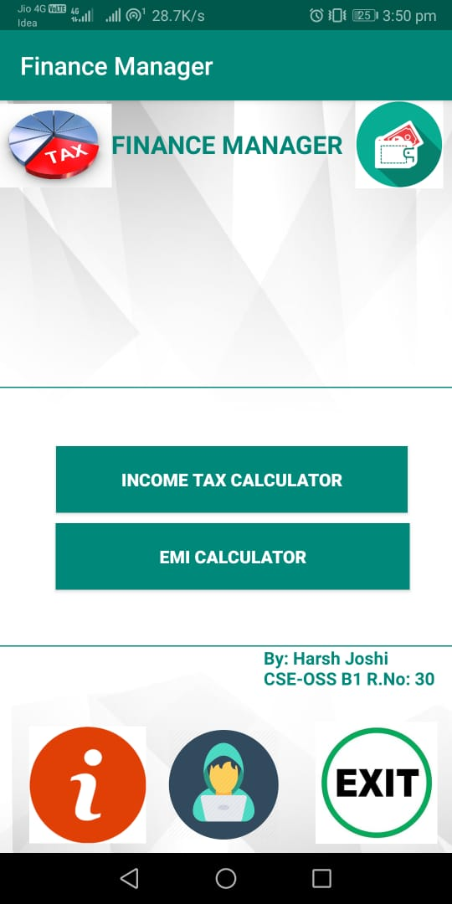
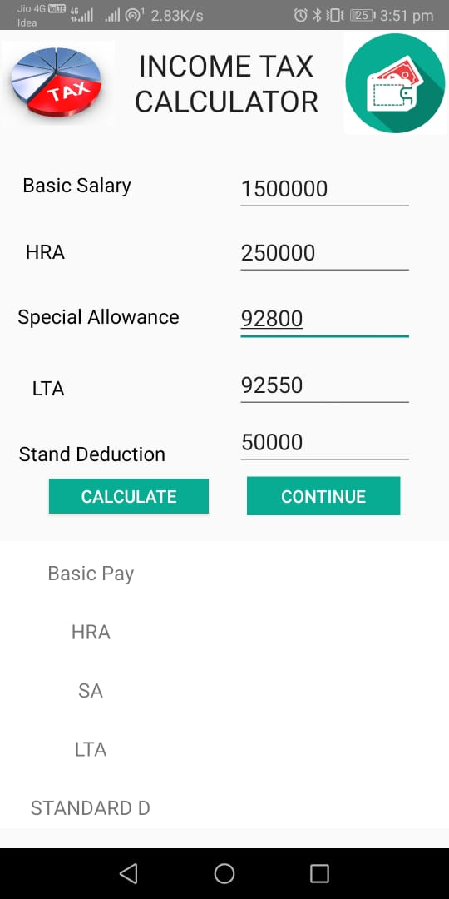
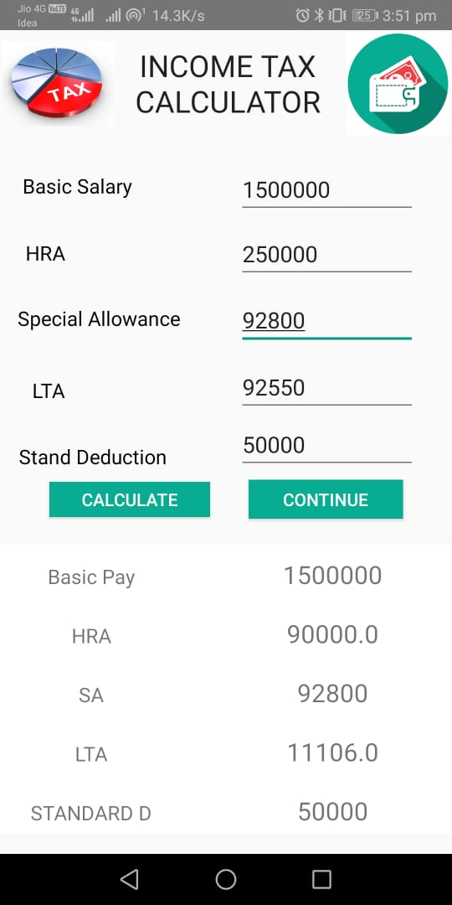
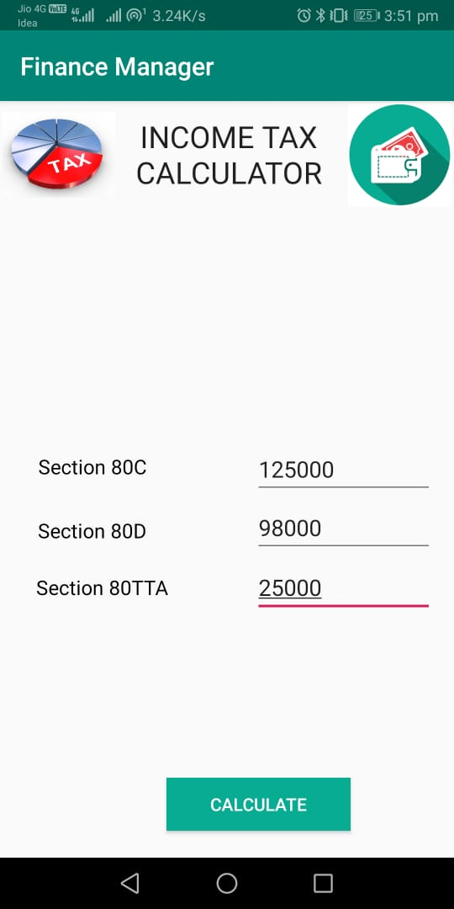
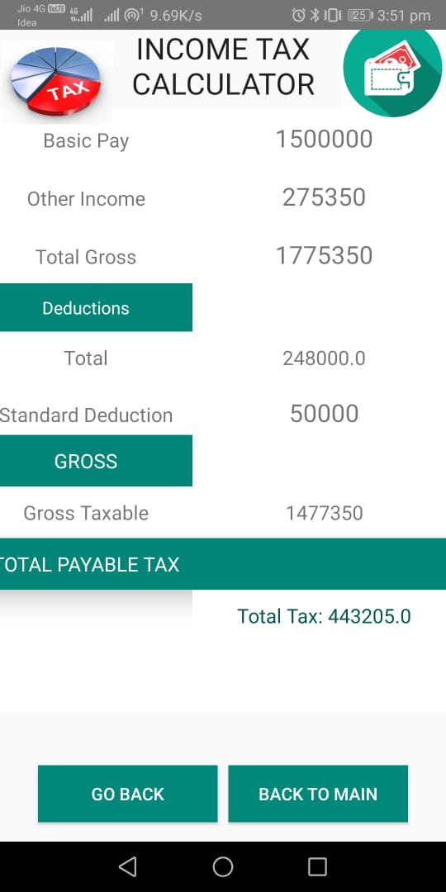
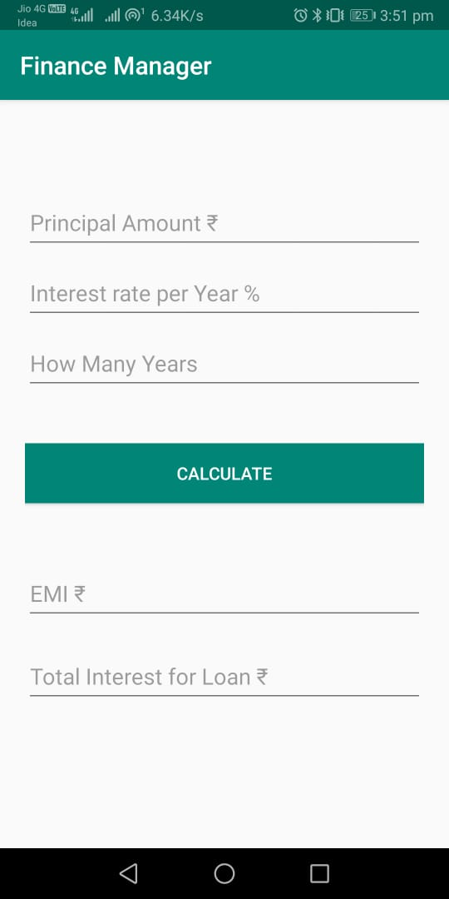
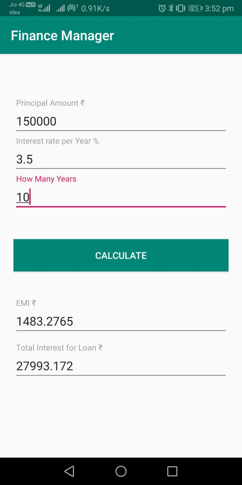

# Finance-Manager
Finance Manager is an Android Application which contains Income Tax Calculator and EMI Calculator.

# Technologies/Platform
* Android Studio
* Java
* XML
* Gradle

# Screenshots 
  

    
   
   
   
   
  
# About
The application is designed to let a user calculate EMI and Income Tax (2019).
### Income Tax Calculation:
Income from salary is the sum of Basic salary + HRA + Special Allowance + Transport Allowance + any other allowance. Some components of your salary are exempt from tax, such as telephone bills reimbursement, leave travel allowance. If you receive HRA and live on rent, you can claim exemption on HRA.
On top of these exemptions, a standard deduction of Rs 40,000 was introduced in budget 2018. This has been increased to Rs 50,000 in budget 2019.
To calculate income tax, include income from all sources. Include:

* Income from Salary (salary paid by your employer)
* Income from house property (add any rental income, or include interest paid on home loan)
* Income from capital gains (income from sale purchase of shares or house)
* Income from business/profession (income from freelancing or a business or profession)
* Income from other sources (saving account interest income, fixed deposit interest income, interest income from bonds)

### EMI Calculation: 
Input the Principalhe Amout, Rate of Interest along with the tenure and get the EMI.

  
# Contributing
Pull requests are welcome. For major changes, please open an issue first to discuss what you would like to change.

Please make sure to update tests as appropriate. You can contribute to fix bugs, add codes and improve the codes.
``
git clone https://github.com/josharsh/Finance-Manager.git
``
